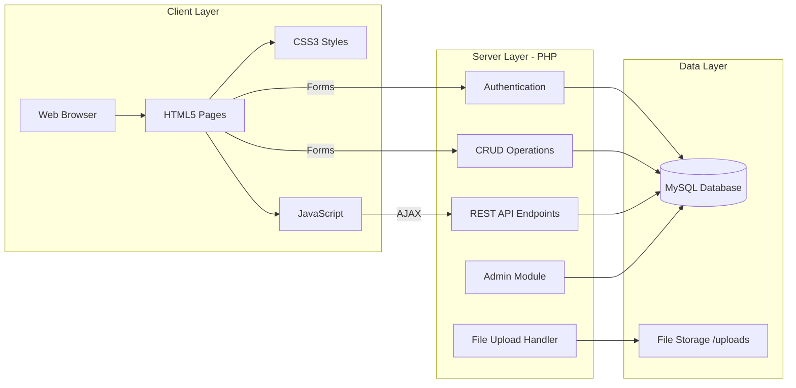
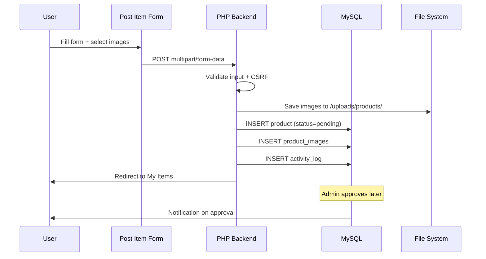
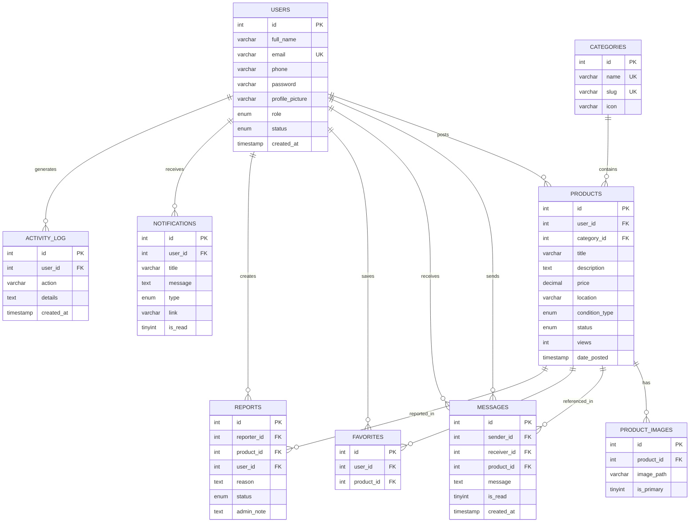

# UsedStore Marketplace — Project Documentation

**Final Year Web Development Project**

---

## Table of Contents

1. [Introduction](#1-introduction)
2. [Objectives](#2-objectives)
3. [System Analysis](#3-system-analysis)
4. [System Design](#4-system-design)
5. [Database Design](#5-database-design)
6. [Implementation](#6-implementation)
7. [Testing](#7-testing)
8. [Conclusion](#8-conclusion)
9. [References](#9-references)

---

## 1. Introduction

### 1.1 Background

The second-hand goods market has grown significantly with the rise of online platforms. Facebook Marketplace, OLX, and Jiji have demonstrated strong demand for peer-to-peer used item trading. UsedStore Marketplace is a web-based platform that enables users within a community to buy and sell used items locally.

### 1.2 Problem Statement

Traditional classified ads lack real-time communication, secure user accounts, and centralized moderation. Sellers struggle to reach buyers efficiently, and buyers lack trust mechanisms when purchasing from unknown sellers.

### 1.3 Proposed Solution

UsedStore Marketplace provides:

- Secure user registration and authentication
- Easy item listing with multiple photos
- Searchable marketplace with filters
- Direct messaging between buyers and sellers
- Admin moderation for quality and safety
- Favorites, notifications, and activity tracking

### 1.4 Scope

The system covers user management, product listing, marketplace browsing, messaging, favorites, reporting, and administrative controls. Payment processing and delivery logistics are outside scope.

---

## 2. Objectives

### 2.1 General Objective

To design and develop a fully functional used items marketplace web application using HTML, CSS, JavaScript, PHP, and MySQL.

### 2.2 Specific Objectives

1. Implement secure user registration and login with role-based access (user/admin)
2. Allow users to post items with images, categories, pricing, and location
3. Build a responsive marketplace interface with search and filtering
4. Create a messaging system for buyer–seller communication
5. Develop an admin panel for user, product, and report management
6. Add favorites, view counters, dark mode, and notifications
7. Design a normalized MySQL database with proper relationships

---

## 3. System Analysis

### 3.1 Existing System Analysis

| Platform            | Strengths                    | Weaknesses                    |
|---------------------|------------------------------|-------------------------------|
| Facebook Marketplace| Large user base, social trust  | Privacy concerns, no standalone app |
| OLX/Jiji            | Category-focused, mobile apps | Ad clutter, spam listings     |
| Classified newspapers| Local reach                  | No images, slow, no messaging |

### 3.2 Proposed System Advantages

- Dedicated marketplace focused on used items
- Admin approval workflow for listing quality
- Built-in messaging without external apps
- Report system for inappropriate content
- Activity logging and notifications
- Free and self-hosted for educational/demo use

### 3.3 User Roles

| Role  | Description |
|-------|-------------|
| **Guest** | Browse marketplace, view item details |
| **User**  | Register, post items, message sellers, manage favorites |
| **Admin** | Manage users, approve/reject listings, handle reports, manage categories |

### 3.4 Functional Requirements

| ID   | Requirement |
|------|-------------|
| FR01 | User shall register with name, email, phone, password, profile picture |
| FR02 | User shall login/logout securely using sessions |
| FR03 | User shall post items with title, description, category, price, location, condition, images |
| FR04 | User shall browse, search, and filter marketplace listings |
| FR05 | User shall contact sellers via messaging |
| FR06 | User shall save items to favorites/wishlist |
| FR07 | Admin shall approve or reject pending listings |
| FR08 | Admin shall block/delete users and manage reports |
| FR09 | System shall track product view counts |
| FR10 | System shall send notifications for messages and approvals |

### 3.5 Non-Functional Requirements

- **Usability:** Responsive design, mobile-friendly navigation
- **Security:** Password hashing (bcrypt), CSRF tokens, prepared statements, session management
- **Performance:** Indexed database queries, paginated results
- **Maintainability:** Modular PHP includes, separated concerns
- **Availability:** Runs on standard LAMP/WAMP stack

---

## 4. System Design

### 4.1 Use Case Diagram

```mermaid
graph TB
    subgraph Actors
        Guest((Guest))
        User((Registered User))
        Admin((Administrator))
    end

    subgraph UserFunctions["User Functions"]
        UC1[Register Account]
        UC2[Login / Logout]
        UC3[Browse Marketplace]
        UC4[Search & Filter Items]
        UC5[View Item Details]
        UC6[Post Item for Sale]
        UC7[Edit Profile]
        UC8[Manage My Items]
        UC9[Send Message]
        UC10[Add to Favorites]
        UC11[Report Listing]
    end

    subgraph AdminFunctions["Admin Functions"]
        UC12[Manage Users]
        UC13[Approve/Reject Listings]
        UC14[Manage Categories]
        UC15[Review Reports]
    end

    Guest --> UC3
    Guest --> UC4
    Guest --> UC5
    Guest --> UC1
    Guest --> UC2

    User --> UC2
    User --> UC3
    User --> UC4
    User --> UC5
    User --> UC6
    User --> UC7
    User --> UC8
    User --> UC9
    User --> UC10
    User --> UC11

    Admin --> UC2
    Admin --> UC12
    Admin --> UC13
    Admin --> UC14
    Admin --> UC15
    Admin --> UC3
```

### 4.2 System Architecture

### 4.3 Data Flow — Post Item

### 4.4 Page Structure

| Page | Path | Access |
|------|------|--------|
| Homepage | `/index.php` | Public |
| Marketplace | `/pages/marketplace.php` | Public |
| Item Details | `/pages/item.php` | Public |
| Login | `/auth/login.php` | Public |
| Register | `/auth/register.php` | Public |
| Post Item | `/pages/post-item.php` | User |
| Messages | `/pages/messages.php` | User |
| Favorites | `/pages/favorites.php` | User |
| Dashboard | `/dashboard/index.php` | User |
| Admin Panel | `/admin/index.php` | Admin |

---

## 5. Database Design

### 5.1 Entity-Relationship Diagram

### 5.2 Table Summary

| Table | Purpose | Key Relationships |
|-------|---------|-------------------|
| `users` | Store user accounts | PK: id |
| `categories` | Product categories | PK: id |
| `products` | Item listings | FK: user_id → users, category_id → categories |
| `product_images` | Multiple images per product | FK: product_id → products |
| `messages` | Chat messages | FK: sender_id, receiver_id → users |
| `favorites` | Wishlist items | FK: user_id, product_id |
| `reports` | User reports | FK: reporter_id, product_id |
| `notifications` | System alerts | FK: user_id |
| `activity_log` | User action history | FK: user_id |

### 5.3 Normalization

The database follows **Third Normal Form (3NF)**:

- No repeating groups (images in separate table)
- All non-key attributes depend on primary key
- No transitive dependencies

---

## 6. Implementation

### 6.1 Technologies Used

| Component | Technology | Purpose |
|-----------|------------|---------|
| Markup | HTML5 | Page structure, semantic elements |
| Styling | CSS3 | Responsive layout, dark mode, cards |
| Scripting | JavaScript | Filters, favorites, notifications, validation |
| Server | PHP 7.4+ | Business logic, authentication, CRUD |
| Database | MySQL | Data persistence |
| Icons | Font Awesome 6 | UI icons |

### 6.2 Security Measures

- **Password Hashing:** `password_hash()` with bcrypt
- **SQL Injection Prevention:** PDO prepared statements
- **XSS Prevention:** `htmlspecialchars()` output encoding
- **CSRF Protection:** Token validation on forms
- **Session Security:** PHP session-based authentication
- **File Upload:** Extension whitelist, size limits
- **Directory Protection:** `.htaccess` blocks PHP in uploads

### 6.3 Key Modules

| Module | Files | Description |
|--------|-------|-------------|
| Config | `config/database.php` | DB connection, constants |
| Auth | `includes/auth.php`, `auth/*` | Registration, login, logout |
| Marketplace | `pages/marketplace.php` | Browse, search, filter |
| Dashboard | `dashboard/*` | User profile and items |
| Admin | `admin/*` | Administrative controls |
| API | `api/*` | AJAX endpoints |

---

## 7. Testing

### 7.1 Test Cases

| ID | Test Case | Steps | Expected Result | Status |
|----|-----------|-------|-----------------|--------|
| T01 | User Registration | Fill register form with valid data | Account created, redirect to login | Pass |
| T02 | User Login | Enter valid credentials | Session created, redirect to dashboard | Pass |
| T03 | Invalid Login | Enter wrong password | Error message displayed | Pass |
| T04 | Post Item | Upload item with images | Item saved as pending | Pass |
| T05 | Admin Approve | Admin approves pending item | Item visible in marketplace | Pass |
| T06 | Search Items | Search by keyword | Matching items displayed | Pass |
| T07 | Filter by Category | Select "Phones" category | Only phone listings shown | Pass |
| T08 | Price Filter | Set min/max price range | Items within range shown | Pass |
| T09 | Send Message | Contact seller from item page | Message saved, seller notified | Pass |
| T10 | Add Favorite | Click heart on item page | Item added to favorites | Pass |
| T11 | Report Item | Submit report with reason | Report saved for admin review | Pass |
| T12 | Block User | Admin blocks a user | User cannot login | Pass |
| T13 | Dark Mode | Toggle theme button | UI switches to dark theme | Pass |
| T14 | Mobile Menu | Resize to mobile width | Hamburger menu appears and works | Pass |
| T15 | View Counter | Open item detail page | View count increments | Pass |

### 7.2 Browser Compatibility

| Browser | Version | Result |
|---------|---------|--------|
| Google Chrome | 120+ | Compatible |
| Mozilla Firefox | 120+ | Compatible |
| Microsoft Edge | 120+ | Compatible |
| Safari | 16+ | Compatible |

### 7.3 Responsive Testing

| Device | Resolution | Result |
|--------|------------|--------|
| Desktop | 1920×1080 | Full layout |
| Tablet | 768×1024 | Adapted grid, sidebar collapses |
| Mobile | 375×667 | Single column, mobile nav |

---

## 8. Conclusion

### 8.1 Summary

UsedStore Marketplace successfully implements a complete used items trading platform with user authentication, item management, marketplace browsing, messaging, and administrative controls. The system meets all specified functional and non-functional requirements.

### 8.2 Achievements

- Fully responsive Facebook Marketplace-style UI
- Secure authentication with role-based access control
- Complete CRUD operations for products and users
- Real-time-style notifications and messaging
- Admin moderation workflow
- Dark mode and mobile-friendly design

### 8.3 Limitations

- No online payment integration
- No geolocation/map-based search
- No email verification for registration
- No real-time WebSocket chat (page refresh required)

### 8.4 Future Enhancements

1. Payment gateway integration (M-Pesa, PayPal)
2. Google Maps integration for location
3. Email/SMS verification and notifications
4. Real-time chat using WebSockets
5. Rating and review system for sellers
6. Progressive Web App (PWA) for mobile
7. Advanced analytics dashboard for admin

---

## 9. References

1. PHP Manual — https://www.php.net/manual/en/
2. MySQL Documentation — https://dev.mysql.com/doc/
3. MDN Web Docs (HTML, CSS, JS) — https://developer.mozilla.org/
4. OWASP Web Security — https://owasp.org/
5. W3C HTML5 Specification — https://www.w3.org/TR/html52/
6. Font Awesome Icons — https://fontawesome.com/

---

**Project:** UsedStore Marketplace  
**Type:** Final Year Web Development Project  
**Stack:** HTML, CSS, JavaScript, PHP, MySQL  
**Server:** WampServer (Apache + PHP + MySQL)
